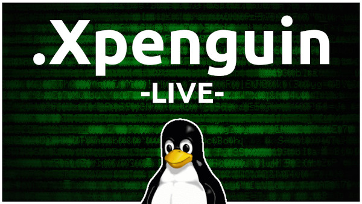
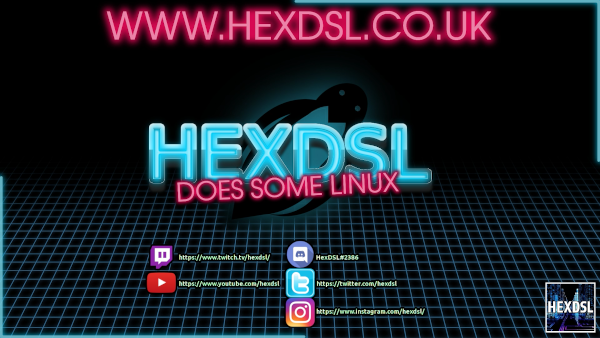
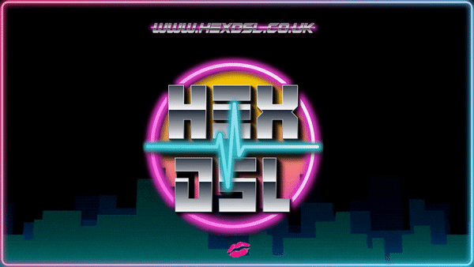
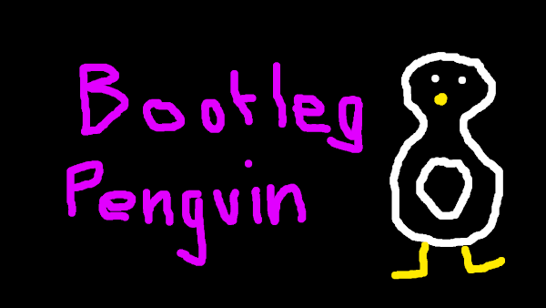

	XX    XX EEEEEEE NN   NN DDDDD   IIIII NN   NN   GGGG
	 XX  XX  EE      NNN  NN DD  DD   III  NNN  NN  GG  GG
	  XXXX   EEEEE   NN N NN DD   DD  III  NN N NN GG
	 XX  XX  EE      NN  NNN DD   DD  III  NN  NNN GG   GG
	XX    XX EEEEEEE NN   NN DDDDDD  IIIII NN   NN  GGGGGG

Over the last few years, there has been an episode of .XPenguin every Saturday. Its occasionally been moved to a  Sunday because of life commitments (and this one time that my net was broken) but I think its fair to say that I have never missed an episode.

The show has evolved wonderfully as time has passed. We have changed co-hosts and visuals and had at least three "intro" videos. The show currently looks better than it ever has. The website looks about as "on brand" as it can and the people who watch appear to *really* like the show,

With all this in mind it is with a sad disposition that I officially confirm the end of 'regularly scheduled .XPenguin episodes' not the forever end. To be clear.

**What?**

Over the last 3 years+ I have spent at around 10 hours a week making sure that .XPenguin is as good as I can make it. I read Linux news daily, I note down any links of articles that I may want to talk about and follow evolving stories as they happen. I force myself to hit Reddit daily (and I really hate Reddit) as well as writing show notes and inviting guests onto the show. Then there's the actual show its self that often runs for two hours. Uploading, creating thumbnails and audio rips for Patreon. What I'm trying to say is, *it's a lot of work.*

**And?**

With this in mind, I want to 'not do a podcast' for a bit. I'm pretty sure that XPenguin will return in a year or so when I'm fired up to do it again, or occasionally when I really have something to say. But, for now. It's on pause.

**How can you do this to us?**

The show is watched by around 15-20 people live, 40 people on bitchute (oddly) and 120-230 people on YouTube (usually.) I have no idea how many people listen on Spotify or RSS it really is well liked. I do feel bad but I would rather take this massive break while the show is well liked than wait for it to start dropping viewers and *then* stop it. Its better to end your show while its good than risk becoming season 5 of Ally McBeal (I know, you haven't seen it, but I assure you it was shit)

**What are we supposed to do now?**

There are other podcasts! There are! - and going forward I will be doing regular streams on Saturdays, pretty much as usual. While they will be "bigger" and more "news filled" than my usual streams they will not be a "formal podcast" or anything like it. It will be me hanging out with friends and chatting about Linux stuff while we play games. The main difference between my regular streams and the new Saturday streams will be that it will more often than not find its way to YouTube and occasionally may show on the .XPenguin website (So to make its way to the RSS and Spotify.) I don't want people to think I'm leaving or fading. I am 100% committed to my channel and the shit I make. Making shit has literally measurably improved my life and I'll not be stopping.

The new format will be called .Hex as an homage to .XPenguin but as I said, not a formal Podcast. Because of this I won't feel too bad if I have to cancel the odd evening when I have things to do with my Daughter or friends. Generally the whole thing will be way more relaxed.

**You did all this alone?**

No. I need to thank the people listed below for literally enabling me to do the show for the last few years! - I did type up the reasons that I was thanking them but it got long. So here are the names of the people that deserve my thanks the most (Alphabetically listed, not in order of awesome, because that would be stressful.)

* AmazingMoox
* ArchToasty
* ChrisWere
* CyberusUK
* HamishTPB
* HangmansJoe
* Kylinx
* LinuxPaulM
* Ozone (SudoShred)
* Uoou

There has also been a remarkable number of guest on the show over the years and without them the show would have been much less fun to make.

**Patreon Supporters**

I intended to write this blog to you guys *before* making this public but unfortunately I sort of, err, accidentally announced the end of the show on stream the other night with Chris. Because of this, there seemed little point in holding it back.

Thank you very much for your support. The Patreon cash helps me pay for the servers that keep everything running (3 digital ocean droplets and 2 domain names) as well as purchase the occasional video game. Thank you!!!

**A Final Thought**

A Long time ago, when I was a baby in the Linux space I did this other 'thing' called QuestHard. It was that show (effort) that made me realise that I wanted to make video and bee part of this community. As I was writing all this, I thought back to that show. Turns out I had the Header still... Thought I would share it. No reason. Just a floating memory.

Hopefully 2020 will be the start of another decade of building a community, making new friends, playing new games and, obviously. Making a LOT of new videos (and blogs.... I like blogs)

Thank you!

