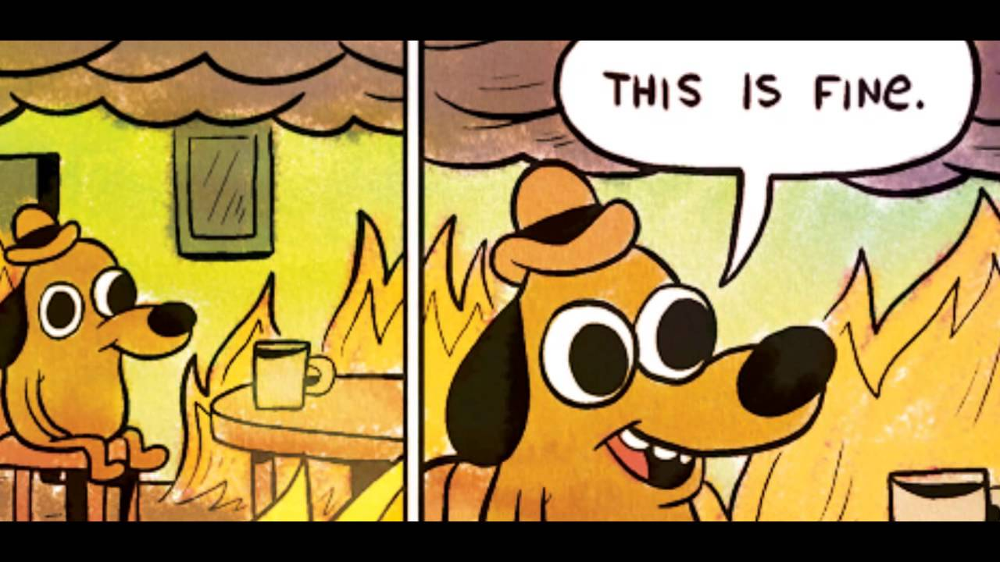

	      ::::    :::::::::::::::::::::: :::::::::
	     :+:+:   :+::+:       :+:    :+::+:    :+:
	    :+:+:+  +:++:+       +:+    +:++:+    +:+
	   +#+ +:+ +#++#++:++#  +#++:++#: +#+    +:+
	  +#+  +#+#+#+#+       +#+    +#++#+    +#+
	 #+#   #+#+##+#       #+#    #+##+#    #+#
	###    #################    ############

*I cower from the evil day star, safe in my gaming hole.*

*you may want to skip to the last paragraph before reading this shit!*

As the world locks down and nails boards over the windows for the Viral Apocalypse I am a little confused as to how little my life has actually changed. I still go to work (I have a job that is related to food supply chain, so no change for me) I come home, watch a show while I make and consume my daily meal. Then I sit at my desk to play/stream video games, and chat with my friends.

Some times I draw (Aseprite, I love pixels) sometimes I watch streaming media. Usually I listen to terrible pop music while I'm here.

My friends are on Discord, my hobbies take place at my desk. I am blessed with being an indoors-man at this time.

I do however worry about the people that are not locked in hermits like me. The people who crave physical contact and require a group to in order to be whole. The people who's hobbies are sports, or events or even museums and talks. These people must feel caged during these times. I have been thinking a lot about these people recently.

I think its our job as veterans of the inside hobbies to educate and inform where we can. And I don't mean, "go fourth an preach the gospel of the inside, cry true the evils of the day star" but to tell people of the thing that we do that allow us to not just "get by" inside but to thrive here. I have some thoughts. I will share them

## Things to know when telling people about your hobbit hole life.

* Never invalidate someones indoor pass times: I know a woman who literally reads for 8 hours at a time and is super happy with it. Most of us read before bed. Or while we eat a bowl of steamed veggies (I want a bowl of steamed veggies right now.... Just saying.) What works for you maybe madness to someone else and you know, Uno Reverse.
* Always Be ready to hear "you are a sad geek" because... Yeah, form their point of view... You are. From our point of view "but you watch tv all day, HOW is that better!"
* There is always that person who thinks your lifestyle is a symptom of depression. I'm a happy dude with good mental health (I think) but someone is always feeling bad for me :/ its annoying.
* Video games are for kids! And watching 14 hours of TV a day is for idiots so flip a coin Tina - don't say that.
* There are people who want to me miserable during lock down, they embrace it. Those people are not for you to help.

## Things to do while the earth is closed.

* **Watch a movie with friends:** Find a movie on a streaming website. Get friends in a voice chat room (I prefer discord) someone (Matt in our case) says "3... 2... 1... go!" and everyone presses the triangle button to make it go. You mostly sit in silence and watch the movie. But the occasional comments from the person you are "sitting with" makes the whole thing more social!
* **Online gaming:** Some people don't want to play Overwatch with you for hours. But some people have never played Overwatch... They may just need you to get them to try it and BOOM a new smack talking Hanso Main is born. Or, you know, Stellaris, Civ, whatever. The point is, new gamers can be born.
* **Your friend Mike has never seen Star Trek:** Mike isn't going to want to leave the house for the next few months because he's about to learn that the joy of Star Trek isn't watching the shows or movies. It's about arguing with you about it. Personally I think Voyager is mostly Trash and TNG is over rated. I also think Data was a pointless character who would have been greatly enhanced if the crew rejected him as an individual. Then slowly over the 7 year run, they thought of him more and more as a person. Eventually they could have told HIM that he was a real boy and all that. Rather than the "knock off Vulcan" we got.
* **Porn:** You could be dry on the inside by the time this is all over. Don't over do it... but you know... if you are not a "user" of porn usually. You may like what this little site called "pornhub" has to offer. Personally I enjoy the offerings of the 'Hentai' category.
* **Finally learn how to use a computer properly:** There are a lot of people that leave comments on my YouTube videos telling me how they don't have time to learn a Tiler, or how to configure a Suckless application. Those people have time now :) - Learn C, Python, Bash.... use this time to level up!
* **I like to draw:** one of the things that I love to do is draw little pixel versions of things in Aseprite. Maybe you would too. OR maybe this is a good time to learn the Cello. Find something you can obsess over or bask in while you are locked it... Like Animal Crossing :)
* **Write a blog post** I'm Just saying that while your daughter is doing school work, you may want to look supportive and not be seen to be playing Animal Crossing while watching Star Trek. You may realise that its better if it looks like you are working hard on something, not fucking around with Tom Nook. You may deicide that the best use of your time is to write a blog post but have no ideas so you basically ramble pointlessly for 1024 words now. yeah.
