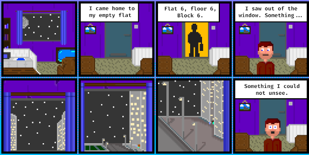
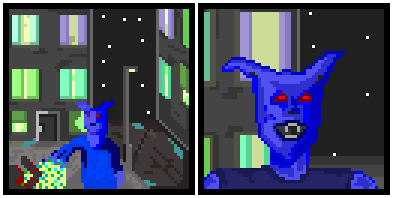

# A Hunter's Garden: Part 1

I wrote a book. It was years ago and up until the start of the year, I had basically forgotten about it. Then when I switched back to using Dropbox I found it in a very old, very dusty folder. I read it. I liked it but *hated* the ending... I deleted the ending.

The plan is to edit it, a little at a time and post it as I go. At some point I'll Have to write a new ending from scratch. Once I do reach the end however, I'll re-work a few chapters and post it as a complete work for you.

For now you will have to read it as I post it (and I won't be committing to a release schedule.)

I was unsure as to if I should post this here or on my http://Pixelfridge.club website. I decided that more people would probably see it here. If it proves a popular experiment it will continue here. If not, Then it will migrate to the other site.

*Everything beyond this point is work of fiction and not to be confused with an item of news. Any resemblance to the real world is imagined by you.*

Here it is...

I made an audio version but I think this one is best read (Because I am not good at recording this type of format)

<audio controls style="width:100%;">
<source src="http://hexdsl.co.uk/hunter/Hunters_Garden_Part_1.mp3" type="audio/mpeg"></source>
Your browser does not support the audio element.
</audio>

[Download](http://hexdsl.co.uk/hexshards/Hunters_Garden_Part_1.mp3) - Right click and save it.

## A Hunter's Garden
### by HexDSL.

## Intent

I planned on opening in the usual way these things do, by talking about the rain or the moonlight or the smells of the city at night, and the truth is that any of those would have done just fine but I have chosen to do something different, I  have chosen honesty.

My name is Michael. No, no I can't go through all of this with my real name, that's too much honesty even for me. My name is Gabriel. No, that sounds stupid, okay, how about I just stick to Mike, yeah. Honesty.

My name is Mike. And I kill vampires. Wow, that really does sound cheesy, an old friend once told me that you can't tell people you fight monsters because you sound so deeply fucking stupid. She was right. Well there's no other way I can say it without sugar coating it or talking in some complicated abstract way. I guess that whatever I could come up with has already been the topic of some overly romanticised teen literature. Yeah, cheese or no cheese, here's the truth, with no romanticised crap to shine the nasty bits.

My name is Mike and I kill vampires. This is my story, oh crap, what now, am I setting myself up for a fucking movie-of-the-week. No, shit, this is going badly, I'm going to stop over thinking this now and just get the hell on with it.

My name is Mike. I kill vampires and I'm recording this because I have fuck all else to do and I'm scared, for the first time in... Well, as long as I can remember. I'm scared, and I regret that there's no one I want to talk to one last time, that there's no family to mourn me and there properly wont be any friends left to bury me. In my final hours I'm using this voice recorder app to explain it all. Why? Because I hate that my profession is little more than the topic of TV shows and fantastical books.

## Honesty: I kill vampires.

It all stared something like six months ago to the outside world. Not that time means very much to me any more. I came home from work, it was about ten at night, and no, I didn't come home to find my family slaughtered or a vampire in my bed. Nothing quite so exciting I'm afraid. I came home to my one bed-roomed flat in the middle of an area that resembled a land fill, the lift was broken again as usual so I had to walk up to the sixth floor. Into the sixth door of the sixth block of flats. Into my boring untidy home. I lived alone back then because I was looser with no girlfriend, not pets and no interests.

I put my fresh twelve pack of cider on the kitchen bench and turned the TV on. It was a ritual for me, after a long day at work I would come home, watch whatever brain dead spoon feeding distraction was on television. Drinking whatever was on offer at the store and wondering when life would start for me. Tonight I was fortunate, life *was* going to be starting.

I sat in my chair for a while switching between ninety's sitcoms and music television. I must have fallen asleep, for a while at least. A sound woke me. The television was showing late night shopping advertisements and the can in my lap was warm. The large window at the front of my living room was open a crack and I could hear some arguing coming from the street below.

I was a little drunk still, and tired. The window was letting in both noise and a chilled breeze so I wondered over to close it. If I had have chosen to stay in the chair then my life would have gone in a totally different direction. I would have probably kept the same job for the rest of my days. Eventually met a girl who didn't hate me and I would have grown old. Probably got run down by a bus in my twilight years. But no, I had to look out of the god damned fucking window.

You see, at the time I didn't know it but I was living in a place that was in what I now know to be a 'void'. A place that is in an ancient holly place, or a future holy site. Or in my case a cursed number. Six hundred and Sixty Six, the number of the beast is what people call it. I'm not sure if that's very accurate but because of this I was able to see events with a 'pure view' as we call it. You see, If I had have lived in flat number 5 or flat number 7 then I would have seen an average every day stabbing. I would have seen a young man in the street get stabbed by a larger man. But no, I lived in flat six, on floor six of block number six. So, I saw what I should not have been able to see. I saw a huge winged creature put it's hand into the chest of a young man and suck out his life... Suck out his soul.

I can tell you one thing, I was a little shocked, and then I did something that was really, really stupid. I banged on my window and shouted some very morally sound things, probably "Noooo" or "why god? why!" or some other shit. To be honest I cant remember exactly what I said but it's really not important because the point is that I drew attention to myself, and when your in a 'void' the window works both ways. That unnatural beast heard me. Instead of looking up and seeing a man who has witnessed what he thought was a random stabbing it looked up and saw my true self. It saw all the things inside me that I never even knew where there. Infinite potential or wasted possibilities. I don't know. I'm not sure how we look to them. But I do reckon that its good you never get to see your own soul. I must have looked good though because he started coming my way.

If you where looking at the event from outside its intricate layers you would have thought that the stabber *(is stabber a word?)* was going to silence a witness. If I had have lived in any other flat that may have been exactly what I thought was happening too. I lived in number six, and because of that I knew that a huge almost stone like monster that could suck a soul out of some one's body was coming for me. I was scared.

I pushed across the blinds with a desperate panic. I turned off the TV and I backed away from that door. My heart was pounding like I had never known before. I had no idea what I was going to do or what that thing was going to do to me. I wasn't even sure what I was waiting for. Would a monster knock the door or ring the bell? What was I going to do? Was I supposed to grab a knife? A baseball bat? You see so many movie's you figure you'll know what to do when something like this happens to you but, trust me, you panic. And if your a selfish useless slice of shit like I was then you hide and cry and pray to a god you don't believe in. I sat on the floor at the side of the door, it seamed as good a place to cower as any other. I was Pathetic.

It turned out that monsters ring the bell. It rang the bell again, and again, and eventually banged at the door louder and louder. Soon it stopped banging the door and I stepped closer, and then closer to it. I was breathing so heavily that its a wonder it couldn't hear me. Maybe he could. I was shaking all over and I leaned a little closer. I could see a shadow in the crack of light at the bottom of the door. The breaks in the strip of light told me that it was still out there. It rang the bell again.

I actually laugh to myself now when I think back to what I was. So scared and so confused. So sure that this was an impossible thing. I should have grabbed the biggest knife I could find from the kitchen and tried to kill the bastard thing. Or, turned it on my own pathetic neck, rid the world of such a waste of skin.

The crack of light cleared and I heard the footsteps of the thing leaving my 'welcome' mat. Then a few seconds later I heard the door at the end of the hall swing closed. I sat there for what seemed like hours, and then eventually I sat on my sofa. I cried, from confusion and fear. I cried like a child until dawn.

It was at dawn for for some reason I felt safe again. I looked out of my window and there was a police car and people by the body of the man I had seen killed. I had seen destroyed. I was sure that it was only a matter of time before the police would knock on my door asking me what I had seen. What would I say? What can you say after that.

It was just about then my mind cleared I was still scared to my core but that urge to live had kicked in. I had some how formulated a plan.

Soon enough the knock came at the door. I could hear the pops and bleeps of a police radio from the other side. As I expected they where doing their job, I opened the door and was greeted with the polite "Good morning sir, I'm sorry to bother you but there has been an incident and we where wondering if you..." I'm not even sure I let him get that far before I blurted out the rambling line I had rehearsed in my head just moments before. "Yes! Yes I saw it all and the guy who did it saw me, he came here and banged on my door!"

What happened next was a blur of questions and answers and more questions, but the next thing that is really relevant to the story happened a few hours later, at the station. I had been through my story at least five times and each time I gave an honest account of what happened, but I use the word 'attacker' instead of monster and 'attacked' instead of describing how the victims soul was pulled into the hand of the monster. I even told them that I could not give a description of the 'attacker' because it was too dark, even though when I had looked through my window it was not that dark, it should have been but it wasn't.

I was actually starting to relax. I was genuinely beginning to feel like I was safe. Surrounded by police and treated like a star pupil. I was after all the only witness to a violent murder. It was when they told me I could go home that the fear set in again. The police officer assured me that he would 'post a man' outside my door and I would be perfectly safe. Like that works in movies? He even started telling me how no one would try anything with a police presence at my house. Even if I wasn't hiding from a monster I wouldn't have trusted that one!

I was scared again, and when I was scared I was stupid. I had convinced myself it would come back for me. The thing would come back as soon as it was dark and kill me. It would walk away without a second thought. I was again without a plan and scared. I told the police officer how I would rather stay at the station and that I didn't feel safe going home but he assured me that the attack was totally random and the knock at my door could have been anyone. He was even amused at how scared I was. That's when the desire to live made me do something that I am fairly sure saved my life. Or was incredibly stupid. I hit the wanker in the face. I hit him so hard that I broke his jaw and then when he hit the floor I kicked him in the ribs. Not proud of that one. Not even a little bit.

As you can imagine all of this was on the police station's CCTV. I was cuffed and ruffed up just a little bit before ending up in a cell by myself. There was a lot of chatter and shouting around the station. I was surprised about the excitement to be honest. I would have thought that police officers got punched in the face often enough for it to be a normal occurrence but they where taking the whole thing very seriously. I hadn't resisted arrest, I had apologised for my behaviour. I wasn't violent by nature, not back then. I did feel bad about hitting the officer, but it kept me in the station for at least the immediate future. I figured it was a good move. Locked in a nice safe cell in a station full of police, the safest place I could be.

Other than the verbal abuse I was getting from the police officer's, a loyal and protective bunch of public servants. I felt safe. I was fairly sure that the monster I saw wasn't going to do a rendition of the Terminator and come into a fully manned police station to get me. Not even in the middle of the night. I slept well, oddly. I have no idea what time it was when I was woken up by the smell of smoke. Not the smoke of a fire but of a cigarette. I sat up fast and with a jolt. The aged mattress in my cell gave off a telling squeak. Holding cell's are not what you come to expect from the education of television. They are tiled rooms with clean floors and a not altogether unpleasant chemically cleaned odour. Most of all there are not entire walls made of bars like you see in westerns. They have large metal doors with little windows covered by a sliding panel. Very civilized.

Anyway, I could smell smoke. It was dark and there was only a subtle light coming from the edges of the cell door, the moonlight streamed in from the little window. I backed into the corner of the little cradle like bed. The telling squeak sounded again. The door of the cell opened and the light form the corridor streamed in, it took a moment for my eyes to adjust.

I was scared, again. A feeling I was starting to adjust to. As my eyes cleared I could see a tall thin man dressed in jeans and a shirt standing in the doorway, he was smoking. The man sauntered into my cell and I knew there was no way he was a police officer. He was too relaxed and rugged, too elegant. He sat down at the end of my little mattress and took a long drag of his cigarette. "you've had a hell of a day haven't you Mike" the worlds left him with an effortless charm. He looked to be in his early fifties and had the demeanour of a war veteran. Steely confidence and a little bit of madness in his eyes.

I swallowed hard, my mouth was dry with fear. "You could say that, yeah" I said. I wasn't really sure what to make of this situation so I thought it was best to just be honest. "I only punched that guy so I could stay in the cell, its safer here" I added. The man took another drag of his cigarette and spoke again. This time with some laughter in his voice "No shit" he said "My names Howard. I know what you really saw Mike, question is, do you?" I was stating to feel better. This was it. This is how it's supposed to happen. If you get into some fucked up super natural shit there's supposed to be a powerful stranger. Someone to come and get you out of it. That's how all the story's go. I sat up "well, I saw a thing. It killed a man. It looked to me like that thing sucked out his soul. It was a white light that came from all over that guy and just got sucked into the scary bastards hand" Howard flicked his cigarette into the hall. "yeah, that's about the gist of it I suppose." He stood up and began to leave "come on then Mike, we had better get to work"

I followed Howard through the hall and to the desk where the night officer was sitting. He stood up and said, "hey, he can't leave" the officer probably had more to say but Howard interrupted with a cold and somehow eerie tone "fuck off" the officer sat back down and pushed the buzzer that opened the door. Howard and I just walked straight out of the station. No one so much as gave us a second look.

When we got into the street outside, Howard changed some how, he looked older and less confidant. He began to talk as he walked down the street "What you saw was a vampire. A big one too. It knows you saw it. It has your scent. It's going to hunt you down. Kill you and keep your soul." At this point I was ready to believe anything. I was about to ask if leaving the safety of the station was a good idea when Howard began to talk some more. "I had to get you out of that station. I need to get you up to speed before it's too late for you" I was worried. That didn't sound good. Howard lit another cigarette and began to walk a little faster. He spoke again "Your flat is what we call a void, its the sixth flat, on the sixth floor or the sixth block and other shit like that. I know that doesn't mean much to you but that makes it a void. A place that allows you to see through The Wind. Not this every day crap that you think reality. There's a lot more underneath that." He sounded crazy. Like the sort of people that write massive paranoid rants all over the Internet. He sounded like a rambling mad man, but I believed him. There was no other explanation on offer so it would have to do.

He talked for another twenty minutes or so. I won't try and remember the exact conversation but Howard told me about Vampires. He explained that there are different types of Vampires but they all want to consume your soul. Some suck it out of you in your blood. Some, like the one I saw, just reach in take it. Some torture it out of you. They are all vampires. Some old. Some young and some don't even know what they are themselves. The part that freaked me out was that apparently now I had seen something through a 'void' I smelled different. I smelled better to these vampires and I had to toughen up before I was lunch. I was scared again. I wanted to believe he was talking shit. I wanted to believe he was a lunatic. I believed every word.

We stopped walking. We where outside a garage. Nothing fancy. Just a garage where you put your car. It was small single car garage with a blue metal door, there where six garages. One was missing it's door. There seemed to be teenagers getting drunk in it. Howard took a key out of his pocket. The key was old, it looked like the key to a castle but some how it fitted the little padlock that kept door locked. I literally can't describe how it fitted. Even now I understand all the little tricks and tools. But I can't actually describe it because its like your brain doesn't actually want you to know some things.

Howard tugged at the bottom of the door and it swung up and open just like any other garage door. Inside the garage, there was no car. There was no oil stained stone floor or anything else that would make any kind of sense. There was a large green field, a blue sky and a man in the distance who appeared to be playing golf. Yeah. I know how it sounds.

This was a magical thing I was seeing. My mind had nothing to compare this to. I think that's the key to dealing with impossible events. Don't try to rationalise it. Just accept it as something new. Normal life does not give you a frame of reference for ancient magical workings.

It was the middle of the night in the city. It was dark and I was looking into a garage and watching a man playing golf on a sunny afternoon. It was impossible. I knew that I was about to sound naive to Howard but I didn't care "What am I seeing? Is that the future or something?" Howard laughed "Don't be stupid, if time travel was possible I'd just go and stop Eve eating that fucking apple wouldn't I? This my friend is the Garden and your are very welcome here." With that he walked into the garage and I followed.

I looked back to where I had come from. It was a swirling hole in the air, There was a static hum. Howard reached back and pulled on the garage door, as it slid closed the swirling doorway vanished. As the last glimpse of the city faded I noticed how dark and lifeless it looked. The humming faded. I felt sick. The change of air and light made me nauseous. Like waking up when light hits your face after a long night's sleep.

"We're safe now, vampires don't exist here" Howard spoke with confidence and I knew I could relax. I had known Howard for less than an hour but I knew that I could trust him. If he said that I was safe then I knew I was. I had no doubt's about this much.

The man that had been in the distance playing golf was walking towards us. As far as I could see in any direction there where massive rolling hills and blistering sunshine. The man looked to be in his early sixties and wore golfers clothes. He was shorter than Howard but just as thin. He looked a lot healthier than Howard though. He seemed to glow with warmth. As he got closer he put his golf bag down. He mopped his brow with a little white cloth and waved for us to come closer. We did. Howard shook the man's hand and introduced me "This is Tom, he's kinda my boss, THE boss" Tom nodded at me and with a well spoken voice he said "Hello Mike, I'm sorry you got dragged into all this"

The three of us talked for ages. I wasn't sure where we where going, I was just happy to feel safe. These men seemed to know what they where doing. What I understood at the time was that Tom was like a vampire hunters manager. He sort of oversaw the 'war' as he called it.

As we walked across the rolling hills Howard and Tom tried to gently tell me about this new world I had fallen into. It seamed like no one ever signed up to hunt vampires. People like me just got mixed up in it when we stumbled on the right conditions to open a 'void.' Once we had, we where targets. We could either join the 'war' or get killed. I tried begging Tom to let me out of this unfair deal. He genuinely seamed to feel sorry for me but as he explained I really only had the two options. I could train to be part of the 'war' or I could go home and be dead before morning. Thinking back, it was nice of him to bother explaining it to me so gently. He should have told me to shut my mouth and be grateful that Howard had the time to save my pathetic hide.

I could see a building in the distance, it was a large white house with ornate little stone walls defining its gardens from the rest of the grassland. It was like a delicate historical manner house. The sort of place you go and visit when your on one of those boring school trips as a kid. There where people every where, some sitting at little metal garden tables with soft white table cloths drinking tea. Some dressed like it was a formal Victorian garden party and other's in quite modern jeans and T-shirts. Most carrying assorted weapons. From swords and knives to staffs and what looked like wands. I had a flash of headache every time I considered what I was experiencing. I was inside a garage that was in what I assumed was another dimension or some other sci-fi trope. I was watching people wondering around a wonderful garden in the sunshine. But it was night time outside the garage and I was supposed to become a vampire hunter or die. My mind was blown. I had very little logical thought going on. I did manage to ask "What the hell am I supposed to do now then?" Howard looked at Tom then at me and with quite an honest and dry tone he said "It's easy Mike, you try not to get killed."

Tom had arranged a room for me in the large white house and instructed me to take a well needed shower and to get some sleep. Howard walked me to my room. The house was luxurious and as clean as the day it was built. There where ornate old fashioned light fixtures and expensive looking ugly carpets all around. It was like a living museum and had not one single sign on wear. Everything was pristine with out a single exception. The house its self was vast like it had been built to house a small platoon of occupants. It looked way smaller form the outside. No magical geometry, it was just a lot longer than it looked from the front.

Howard stopped outside a heavy looking white door with a brass knob in a corridor that had red floral wallpaper and vase next to the door. "This is your room now" Howard said. I looked at the door, there was no lock and no number, it was just a plain white door and an oversized knob. I wasn't sure what I had expected but at the very least I thought I would be shown around a little. "Is there anything I need to know?" I asked sheepishly. Howard yawned a little, he was tired and did not want to tolerate my silly questions for much longer. "Just take as much time as you need and take what you like out of the wardrobe. I’ll be around when your rested" and with that, he walked off in a rush to get to sleep I think.

I looked at the door for a moment before opening it. I reached down to the large brass knob that protruded from it. The door was as heavy to open as it looked. Inside my room I was surprised to find a massive bed like you would see in the grandest hotels. No duvet. Layers of thick blankets were draped across it. It was decorated as I expected from what I had seen of the rest of the house. There was a large fine wooden wardrobe and a window that seemed to be screwed shut. There was also smaller door on the far side of the room. I quickly found that this opened to my own Victorian styled bathroom. It contained a raised bath on tiny metal legs and had one of those shower heads that was screwed onto the taps. There where towels aplenty and even an assortment of colognes with some shaving supplies. It was like this room had been laid out for a visiting dignitary. In the main bedroom the wardrobe was stocked with clothes and shoes. Lots of them. I didn't investigate that too closely. I closed the thick curtains and crawled into the bed for the best sleep I had ever had.

There where no clocks in the house and my watch had been taken from me by the police when I was rightfully slammed into a cell. I had no idea what time it was. I slept for hours, I assume. When I awoke the sun was still streaming in through the gap in the curtains, I wasn't sure what that meant but as no one had woken me up I assumed it was okay, and I had not slept past my quote. I took a quick bath as an indulgence. And because I didn't really understand how the shower tap worked. The towel that I found next to the tub was the finest quality that I had ever felt. It was fluffy and soft but also heavy and large. Granted I wasn't that well travelled but I knew quality, even then.

I was feeling rested and fresh. My jeans however did not have the same glow of freshness that I had acquired. I investigated that wardrobe in more detail. It was well stocked with various garments. The main door revealed shirts, of assorted designs. Mostly single colours. Suits, Cargo pants, Jeans. It was crammed full of options, all my size of course. This made me smile to myself and came as no shock to me. This place was as perfect as it could be. The deep drawers at the bottom of the wardrobe contained assorted foot wear, from classic dress shoes to the most modern running shoes. The more modern stuff looked oddly out of place. The chest of drawers next to the wardrobe contained an indulgent assortment of underwear, including an odd amount of socks. I took some fresh blue jeans of superb quality, a black T-shirt and a rather nice brown suede jacket. Granted my fashion sense was not at its best but I thought I looked good. I decided to stick with my own trainers, they where nice. I checked myself out in the mirror, I looked good. I passed my own test of style and to be honest at that point I didn't care what anyone else thought.

I had not been told what to do next so I wandered through the house. There where lots of people, they all ignored me for the most part. They all looked like they where busy going to somewhere, meetings maybe? No laptops in sight.I did get the occasional smile and nod. I felt like I had been there forever. I eventually found myself walking out of some already open patio doors into the wonderful garden where I could see Tom, sitting in a little garden chair drinking tea, alone. He waved me over.

"Hello Mike, did you sleep well?" asked Tom politely as I sat down. "Yes thank you. How long was I out for?" his response really did come as no shock at all to me, in fact I think I half expected it "Oh. It doesn't really matter, time has no real hold over us here. You slept as much as you needed, and that's a good thing." I had a feeling that my relationship with Tom was going to be filled with cryptic lines and half truths. I was not to be disappointed.

There was quite a range of fruits, cheese and bread on the little table. Tom told me to eat. Unsurprisingly the food was exquisite. Rich flavours and bold colours struck me with everything I sampled. I was starting to get the idea. Everything in the Garden was always going to be perfect. I asked the obvious question "What is this place? It's like a dream" Tom smiled and poured me some tea from a little pot. There where still a lot of people in the garden. Some where obviously on the way somewhere and some where just sitting reading or like us taking tea and nibbles in the sun. Tom took a deep and filling breath "This place is, our sanctuary, Its anything we need it do be."

Tom asked me about my life, he listened intently to all the events that had led me to this afternoon tea. He listened about how I had not been popular at school and how I went from pointless job to dead end job to no job and then to crappy job. He honestly seemed interested in me, no one ever had been before. He listened to how I came home and got drunk, and how I looked out of the window and saw that thing, that monster. How I saw the vampire kill a stranger. He listened to how I sat cowering in fear for the whole night. He did not judge me. He didn't tell me I was a coward. He understood that I was a civilian and I was part of an impossible event.

He then went on to tell me about Voids and that any place that was derived from significant numbers or a holy patch of land from the past or future could, on occasion serve as a void. They could become a doorway under the right conditions. He explained that the reason I had never seen anything through the window of my flat before was probably because there had been nothing to see before.

He told me about the unseen hand that they called 'The Wind.' 'The wind' is the reason that people do not see these strange things every day. 'The Wind' is the ethereal misdirection that makes most people see impossible events as everyday ones. No one really knows how it works but you can rely on it to cover your tracks. It will make the slaying of a vampire in a public place appear to be a work of entertainment to the crowd. A chase between you and a pack of vampires to be looked upon like a policeman chasing a crook. 'The Wind' is natures lie that keeps the two worlds apart. Only after someone has seen through a 'void' for the first time is it possible for them to accept the world without 'The Wind' and even then, it takes dedication to see the world for what it really is.

One point was repeated to me over and over. If you are killed by a vampire you're not just dead. Your immortal soul is trapped inside it until it dies. A person killed by a vampire is not at peace and will not move on. They are forced to endure in the darkness where every moment is a thousand years of torment. It's this darkness that allows them to live for so long and with enough souls as fuel they will have limitless power. When a hunter kills a vampire they are putting the souls of all it's victims to rest. This, I was told. Was work to take pride in.

I remember clearly the final thing that Tom said to me while we drank tea, it was haunting at the time. He took the last sip of his tea and leaned forward and said "I'm sorry Mike. You are part of our world now. Through no fault of your own. You are part of it none the less. Try not to get killed." he leaned back again and added "If you must, then die well." He lent further back in his chair and looked up at the perfect clouds for just a moment. He then stood up, smiled at me and walked away from out little table.

As he left he a called over a young woman who stood by the wall to the side. She was a soldier, she carried many weapons and made no effort to hide it her hair was in a neat pony tail an her jacket was a flattering fit. It was the kind of thick material, not really military looking but the kind of jacket you see those hunter types wear. Her leg wear matched, functional and well fitting. He spoke to her briefly, I couldn't make out what was said but she briskly walked over to me as Tom slowly walked away. She was quite short and looked to be in her twenties. She did not sit down. "Mike?" I nodded "I'm going to get you combat ready. Come with me please" she spoke sternly, I followed her without saying anything. We went to the far wing of the house and entered what appeared to be a training room, or Dojo of sorts.

There where one or two groups of people training with swords and some practising martial arts. The room was large enough that you could play football in there if you wanted to. The floor had rubber padded training mats scattered around and what I assumed where wooden training weapons on the walls. There were also some very interesting wooden chests and cupboards around the edges of the room. I didn't get to inspect them closely. There was one much larger cupboard in the middle of the wall directly opposite the entrance. It was slightly sloped towards the top and had a different look to the rest of the room. I was a rougher older looking wood.

The young woman, who had not bothered to properly introduce herself, handed me a leather wrist band that she had fished out of one of the chest while I was taking in my new surroundings. "Put his on" she barked.

The wrist band looked like a cheap TV prop, it was thick and chunky brown leather it looked mass produced and had some holes punched in it. It was about six centimetres wide and had a brown rough string tried to one hole. I realised this this would be how I fastened it. I put on the wrist band using the string and holes to make it snug. "What is this?" I asked as I messed with the fit. She took hold of my arm and tightened it a properly for me. "Just because you saw one vampire it does not mean your free of the wind. This is a training tool. It will help you see more clearly" I nodded, it seamed to make sense that seeing through this supernatural force would require some training, "How does it work?" I asked. The woman ginned menacingly "pixie magic." I wasn't sure if she was joking or not but thought it best to to challenge her further.

Then she asked me "Do you have any experience with weapons?" I answered honestly "No, I'm sorry. I'm more a Video games and pizza kind of guy than a..." she nodded and waved a hand as if to silence me. She took a small charm out of one of the drawers closest to her. She tied the charm to my wrist band. It looked like a blue crystal wrapped in a thin red string. It seamed to glow. "Your going to be a warrior soon. This charm will give you the knowledge. Then it will be gone" she said cryptically. I had no idea what that meant but I nodded.

She then handed me two small daggers. They where unimpressive to look at. The were simple straight pointy things with red fabric wrapped around the handles an tied off at the base. There was no other ridges on them but there was a sharp looking blade on each edge.

She asked if I knew how to use them, I shook my head while I admired them, studied them. I had never held an actual weapon before.

The woman took a sword from the wall and without warning he swung it at me. Shocked I stumbled back and instinctively I tried to block her attack by pushing the flat portion of my blade flat against my wrist and allowing the sword to impact that. Something that made perfect sense to me but I had no idea why at the time. I was actually oddly impressed with myself. I held the other dagger in the air ready to attack. I could see the blue charm on my wrist glowing vibrantly. It grabbed my attention away from the actual attack. I hadn't had a close look at the charm before. It was a tear drop shape tied haphazardly but very firmly with the red string. The charm its self caught the light, or did it glow? It was quite pretty.

My training partner while still pushing against my dagger leaned in to catch a glimpse of my charm. She nodded and stepped back, releasing her attack stance and lowering her weapon. "You're ready now" she said. "What? I don't get any training? That's it?" I must have sounded so desperate. She closed the doors to the cupboard she had opened. "we don't train anyone here. You train yourself, we just give you the tools to do it properly" she put Her sword back on the wall and instructed me to go and find Howard in the garden outside. I admired the daggers for one last moment and offered them back to her. She shook her head "keep hold of those for a little while, until you fancy something a little more refined." she then pushed them gently back to me. "okay, thanks. I think" I paused for a moment while I realised that I was likely to injure myself. "Do you have a box or something?" I asked earnestly. She sighed with very real irritation. She snatched them out of my had and effortlessly flipped them over in her hand. She the stepped a little closed and slid one into each of my jacket pockets. "were done. Howard is looking after you. He's in the front garden."

As I tried to find the right path back to the exit I had used earlier I was thinking to myself about the events of the morning. I stopped at a window in the hall an looked at my reflection for a moment. I wanted to fit in here. I didn't want to die and I liked Howard. I wanted to pass inspection. My focus changed for a moment and I saw the people carrying weapons openly outside. I moved my daggers from my pockets and pushed them down the back of my belt so the handles were pressing into my spine. It probably wasn't that safe but it would look a lot smoother when I pulled them out. Howard was bound to ask if I had everything I needed and I didn't want to fumble my armed début.

Sure enough Howard was waiting at the door to the garden. He was smoking, as I had come to expect. I hand not paid much attention to how he looked last time we met but I did this time. He was wearing a black shirt and jeans with baseball shoes. He carried a black canvas messenger bag. His hair was grey and his stubble was too little for a beard but too much for a days growth. He was also quiet scrawny. There was nothing really remarkable about him. I had a feeling that this was by design.

"Are we ready to get your vampire now?" He asked. Howard seamed well rested now. I asked him what the plan was and he said that he didn't like plans. We walked a little way away past the garden wall. Howard took two stick from his satchel and banged them together. The sticks looked like thick drum sticks with a short thin black ribbon hanging from each. In the time it took for him to strike them together again I blinked. Instantly I was somewhere else. I was standing in the garage, the door was half open and it was dawn.

The city Snapped into focus a few moments later and my ears were flooded with the sounds of my world again. I felt sick and a little disoriented.

There was no field. No Sunshine and no white house. I shook off my moment of confusion and then I tasted that air. No longer the crisp clean country air of the garden but instead the tainted oily air of a city. I was back where I belonged. Back in the real world. Back where there as no magic and no sword fights with attractive strangers. No tea with interesting gentlemen an most worryingly no promised safety from supernatural soul stealing monsters.

I was scared again.

## MORE SOON....
