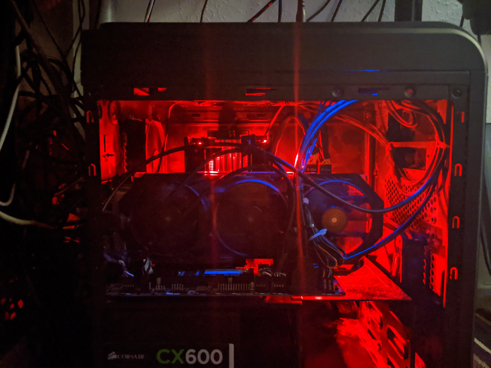

## Upgrades, Rambles and Half Baked Thoughts - An Opus.

It has been a little while since I wrote a thing. It's not that I have been sort of thoughts to write about but more that finding the time to tap those thoughts into Vim has been a problem. Not that anyone reads this *really* (lol?)

The last update was about the office carpet and re-shuffle. Since then there have been PC upgrades, games played and thoughts had.

## PC Upgrades.

I had a little money saved and managed to 'gather' enough together to get the parts I wanted. For the benefit of historical documentation allow me to show you this table.

PART     | OLD           | NEW
---------|---------------|--------------------------------------
CPU      | Intel I7 3770 | AMD R4 3600
RAM      | DDR3 16GB     | DDR4 32GB (Corsair LPX)
MB       | Gigabyte ?    | MSI B450 Mortar Max
STORAGE  | 126GB ssd     | 2x Crucual NVMe Drivers (1GB/500GB)
STORAGE  | 3 TB Rust     | 1tb 2.5inch Rush (for Archival)

Things I kept from my old build were:

* Case - Aerocool DS Cube (MATX)
* PSU - Corsair Builder 600
* Graphics card - Gigabyte branded NVIDIA GTX 970  (Windforce cooler)

The original plan was to keep the stock cooler but quickly I came to the realisation that I was a little hotter than I was happy with.

## With great Hardware come great re-install.

Once built, and having new hard drives it was time to install my OS on this wonderful little bundle of joy. I eventually got Arch all set up and properly configured with the help of Friend Drew (Friendo, Uoou) who cut down my install time by knowing things (We chatted via Discord on my phone)

I just say, on a side note the arch install guide is literally shit. They changed things, made things unclear and generally the whole thing would be a nightmare for a new user. Just make a fucking install script you nasty elitist hipsters.... For real, how does giving people a nice easy to use TUI Installer detract from what Arch is??? Hu??? How?? I get you gotta "learn how to" blah blah blah... I HAVE the skills to install Arch (Because its not as hard as meme lords make out) but I almost installed Manjaro because I had better things to do... .. .. rant over.

My OS is on my 500GB NVMe and my Home folder is on the 1TB one. I also put in my old 1TB 2.5 inch Mechanical drive to use as an "Archive" drive for OBS stuff, System Snapshots and basically anything that I don't have to care about speed for. Its currently got 900GB free, so its not seeing much use. Still best to use it than to let it gather dust, I suppose.

As for Software selection, I went with my usual choices mostly.

BSPWM - A quality tiler but honestly DWM or BSPWM was a toss of a coin. They are both great and either would make me happy.
Editor - NeoVim with my usual Config.
Dots - Same old Git lab repo.
Storage - Dropbox because its cheap.
Games - Yes.
File Manager - Ranger for most things and Thunar for editing.
Problems - no.

## Challenges

* Cant get google-drive-ocaml to compile.
* Don't seem to be able to convince my older appimage of KDENLIVE to use all 32gb of RAM
* I find myself wanting a new mouse (Unrelated, I suppose)
* I can not afford a new graphics card. Thats a shame because its the last thing I need for this to 'feel' like a new PC

Anyway, all of this is my way of saying sorry. I missed a few uploads and have had some distracted streams. Normal service has now been resumed. Including this pointless Blog that NO ONE reads.

Thanks for Reading.
